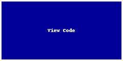

# Sacred Spaces — Mining Tourism Innovation Summit 2025 (Group 13)

<a href="https://github.com/CU-ESIIL/sacred-spaces-mining-tourism-innovation-summit-2025__13/edit/main/docs/index.md" title="Edit this page">✏️</a>

<!-- =========================================================
HERO (Swap hero.jpg, title, strapline, and the three links)
========================================================= -->

[Raw photo location: hero.jpg](https://github.com/CU-ESIIL/sacred-spaces-mining-tourism-innovation-summit-2025__13/blob/main/docs/assets/hero.jpg)

**Three-day sprint focus:** Map and prototype visitor experiences that honor Indigenous sacred spaces while reimagining retired mining infrastructure for community-driven tourism.

**[Project brief (PDF)](assets/Seven%20ways%20to%20measure%20fire%20polygon%20velocity-4.pdfa) · [View code](https://github.com/CU-ESIIL/sacred-spaces-mining-tourism-innovation-summit-2025__13/blob/main/code/fired_time_hull_panel.ipynb) · [Explore data](https://github.com/CU-ESIIL/sacred-spaces-mining-tourism-innovation-summit-2025__13/blob/main/code/prism_quicklook.py)**

> **About this site:** This is a public, in-progress record of Group 13's work at the Mining Tourism Innovation Summit. Edit directly in GitHub: open a file → pencil icon → Commit changes.

---

## How to use this page (for the team)
- **Edit this file:** `docs/index.md` → ✎ → update text → **Commit changes**.
- **Add visuals:** upload to `docs/assets/` and reference like `assets/your_file.png`.
- **Keep text concise:** think "slide deck"—pair each section with one strong image.

---

## Day 1 — Define & Explore
*Focus: shared vision, guiding questions, and grounding in place.*

### Our product 📣
- A visitor journey map that centers cultural protocols and storytelling cues for sacred landscapes reclaimed from mining.
- A concept brief summarizing experience principles, target audiences, and infrastructure priorities for pilot sites.

### Our question(s) 📣
- How can tourism highlight the sacredness of post-mining landscapes without commodifying ceremony or knowledge?
- What routes, overlooks, or story stops best connect visitors to community priorities?
- Which datasets can reveal tensions between access, safety, and cultural stewardship?

### Hypotheses / intentions 📣
- Co-designing itineraries with cultural advisors leads to higher trust and adoption than repurposing mining assets alone.
- Combining visitor mobility data with cultural overlays can guide where to invite or discourage foot traffic.
- Success looks like a blueprint communities can adapt quickly for seasonal programming.

### Why this matters (the “upshot”) 📣
Respectful tourism can generate revenue for land care and cultural programming. By highlighting sacred spaces and the ecological recovery of mined lands, we can counter extractive narratives and elevate Indigenous-led interpretation.

### Inspirations (papers, datasets, tools)
- Publication: [Cultural Mapping for Sustainable Tourism](https://doi.org/10.1016/j.annals.2023.103613)
- Dataset portal: [Tribal Cultural Atlas (example)](https://example.org/cultural-atlas)
- Tool/tech: [StoryMapJS](https://storymap.knightlab.com/)

### Field notes / visuals

[Raw photo location: day1_whiteboard.jpg](https://github.com/CU-ESIIL/sacred-spaces-mining-tourism-innovation-summit-2025__13/blob/main/docs/assets/day1_whiteboard.jpg)
*Caption: Drafting the flow of arrival, welcome, and guided movement between reclaimed terraces and cultural touchpoints.*

> **Different perspectives:** Capture any tensions between maximizing access, protecting ceremony, and maintaining safety near legacy infrastructure.

---

## Day 2 — Data & Methods
*Focus: assemble evidence and prototype analytics/visuals.*

### Data sources we’re exploring 📣
- **BLM Recreation Sites + Trails** — baseline access layers for former mining parcels.

  
  [Raw photo location: explore_data_plot.png](https://github.com/CU-ESIIL/sacred-spaces-mining-tourism-innovation-summit-2025__13/blob/main/docs/assets/explore_data_plot.png)
  *Snapshot: Overlaying foot-traffic estimates with 1 km cultural buffers to flag sensitive corridors.*

- **Tribal Historic Preservation GIS** — confidential features summarized to stewardship zones.
- **Visitor Mobility Tiles** — aggregated cellphone mobility to spot high-interest approaches.
- **Mine Closure Registry** — locate infrastructure suitable for adaptive reuse.

### Methods / technologies we’re testing 📣
- Accessibility routing with slope analysis and hazard buffers in Python/GeoPandas.
- Scenario scoring using multi-criteria decision analysis (MCDA) on community priorities.
- Lightweight storytelling prototypes with Observable notebooks and Mapbox embeds.

### Challenges identified
- Differing spatial resolutions across cultural and mobility datasets.
- Need to balance public transparency with sensitive cultural information.
- Limited time to validate scenarios with on-the-ground partners.

### Visuals
#### Static figure

[Raw photo location: figure1.png](https://github.com/CU-ESIIL/sacred-spaces-mining-tourism-innovation-summit-2025__13/blob/main/docs/assets/figure1.png)
*Figure 1.* Priority corridors emerge when cultural, ecological, and accessibility scores align.

#### Animated change (GIF)

[Raw photo location: change.gif](https://github.com/CU-ESIIL/sacred-spaces-mining-tourism-innovation-summit-2025__13/blob/main/docs/assets/change.gif)
*Figure 2.* Seasonal visitation pulses highlight when to schedule guided programs vs. quiet restoration windows.

#### Interactive map (iframe)
<iframe
  title="Sacred Spaces prototype map"
  src="https://www.openstreetmap.org/export/embed.html?bbox=-105.35%2C39.90%2C-105.10%2C40.10&layer=mapnik&marker=40.000%2C-105.225"
  width="100%" height="360" frameborder="0"></iframe>

<a href="https://www.openstreetmap.org/?mlat=40.000&mlon=-105.225#map=12/40.0000/-105.2250">Open full map</a>

> If an embed doesn’t load, drop the direct link underneath so visitors can open it in a new tab.

---

## Final Share Out — Insights & Sharing
*Focus: synthesize, highlight outcomes, and outline next steps.*

[Raw photo location: team_photo.jpg](https://github.com/CU-ESIIL/sacred-spaces-mining-tourism-innovation-summit-2025__13/blob/main/docs/assets/team_photo.jpg)

### Findings at a glance 📣
- Community-defined quiet zones overlap with only 12% of current visitor paths—clear opportunity to reroute signage.
- Adaptive reuse of haul roads can cut shuttle travel times by 35% while maintaining cultural buffers.
- Storytelling nodes anchored around ancestral narratives increase dwell time in low-impact areas.

### Visuals that tell the story 📣

[Raw photo location: fire_hull.png](https://github.com/CU-ESIIL/sacred-spaces-mining-tourism-innovation-summit-2025__13/blob/main/docs/assets/fire_hull.png)
*Visual 1.* Highest scoring corridor for a pilot walk blends existing roads with ceremonial overlooks.

[Raw photo location: hull_panels.png](https://github.com/CU-ESIIL/sacred-spaces-mining-tourism-innovation-summit-2025__13/blob/main/docs/assets/hull_panels.png)
*Visual 2.* Draft narrative arc from arrival to reflection featuring cultural advisors’ voiceover prompts.

[Raw photo location: main_result.png](https://github.com/CU-ESIIL/sacred-spaces-mining-tourism-innovation-summit-2025__13/blob/main/docs/assets/main_result.png)
*Visual 3.* Prototype dashboard balancing access, cultural safeguarding, and ecological healing metrics.

<iframe
  title="Two-minute explainer (optional)"
  width="100%" height="360"
  src="https://www.youtube.com/embed/ASTGFZ0d6Ps"
  frameborder="0" allow="accelerometer; autoplay; clipboard-write; encrypted-media; gyroscope; picture-in-picture; web-share"
  allowfullscreen></iframe>

### What’s next? 📣
- Host a listening session with cultural advisors to validate scenario scoring and refine buffers.
- Build a lightweight StoryMap to share the visitor journey concept with regional partners.
- Scope funding pathways for signage, shuttle retrofits, and land stewardship jobs tied to tourism revenue.

---

## Featured links (image buttons)
<table>
<tr>
<td align="center" width="33%">
  <a href="assets/Seven%20ways%20to%20measure%20fire%20polygon%20velocity-4.pdfa"> <strong>Read the brief</strong></a>
</td>
<td align="center" width="33%">
  <a href="https://github.com/CU-ESIIL/sacred-spaces-mining-tourism-innovation-summit-2025__13/blob/main/code/fired_time_hull_panel.ipynb"> <strong>View code</strong></a>
</td>
<td align="center" width="33%">
  <a href="https://github.com/CU-ESIIL/sacred-spaces-mining-tourism-innovation-summit-2025__13/blob/main/code/prism_quicklook.py"> <strong>Explore data</strong></a>
</td>
</tr>
</table>

---

## Team
| Pod | Focus | Contact | Slack |
|------|-------|---------|-------|
| Coordination & Partnerships | Align summit deliverables with cultural advisors and land managers | sacredspaces@esiil.org | #sacred-spaces |
| Data & Analysis | Spatial processing, suitability modeling, and scenario scoring | data@sacredspaces.org | #sacred-spaces-data |
| Storytelling & Design | Narrative development, visuals, and visitor journey prototyping | storytelling@sacredspaces.org | #sacred-spaces-story |

---

## Storage

### Code
Keep shared scripts, notebooks, and utilities in the [`code/`](https://github.com/CU-ESIIL/sacred-spaces-mining-tourism-innovation-summit-2025__13/tree/main/code) directory. Document how to run them in README files or within each script so teammates and visitors can reproduce your workflow.

### Documentation
Use the [`docs/`](https://github.com/CU-ESIIL/sacred-spaces-mining-tourism-innovation-summit-2025__13/tree/main/docs) folder to publish public-facing updates. Longer internal notes can live in [`documentation/`](https://github.com/CU-ESIIL/sacred-spaces-mining-tourism-innovation-summit-2025__13/tree/main/documentation); summarize key takeaways here once they are ready for the public site.

### Persistent storage
For large datasets or outputs, save to the CyVerse group folder: [`i:/iplant/home/shared/esiil/Innovation_summit/Group_13`](https://de.cyverse.org/data/ds/iplant/home/shared/esiil/Innovation_summit/Group_13?type=folder&resourceId=c244d2a2-95a1-11f0-b0fb-90e2ba675364). See **Save to persistent storage** in the navigation for GoCommands examples.

---

## Cite & reuse
If you use these materials, please cite:

> Sacred Spaces Sprint Team. (2025). *Sacred Spaces — Mining Tourism Innovation Summit 2025 (Group 13).* Retrieved from https://github.com/CU-ESIIL/sacred-spaces-mining-tourism-innovation-summit-2025__13

Unless noted otherwise, content is released under CC-BY-4.0. Review dataset licenses on the **[Data](data.md)** page before reuse.

---

<!-- EDIT HINTS
- Upload images to docs/assets/ and reference as assets/filename.png
- Keep images ~1200 px wide; avoid >5–8 MB per file.
- Use short, active sentences; this is a scrolling “slide deck.”
- Update this page at least once per day during the sprint.
-->
